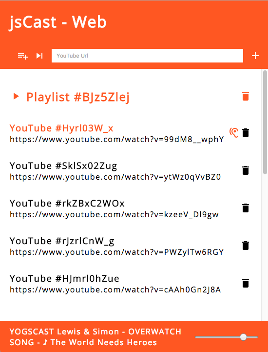

# jsCast

[![NPM Version][npm-image]][downloads-url] [![NPM Downloads][downloads-image]][downloads-url]

**An Audio Streaming Application written in JavaScript**

- _storage types / API_
- _input (item) types / API_
- _plugin types / API_
- _CLI support_
  - _whitelist / blacklist_



## Quick Start

### Using CLI

Install jsCast globally:

```sh
$ npm i -g jscast
```

Use the new command to start an instance:

```sh
$ jsCast
```

- override default port: `-p PORT` / `--port PORT`
- change storage type: `-s TYPE` / `--storage-type TYPE`
- set active plugins: `-t TYPE1,TYPE2` / `--plugin-types TYPE1,TYPE2`
- ffmpeg binary path: `--ffmpeg-path PATH`
- initial youtube items - fillable storage types **only**: `--youtube-items URL1,URL2`
- whitelist: `--whitelist COUNTRY1,COUNTRY2`
- blacklist: `--blacklist COUNTRY3,COUNTRY4`

### Using Script

```javascript
import jsCast from "jscast";
import { log } from "util";

const instance = jsCast().on("clientRejected", (client) => {
  log(`client ${client.ip} rejected`);
});

const icyServer = instance.pluginManager.getActiveType("IcyServer");
const webClient = instance.pluginManager.getActiveType("WebClient");

instance.station
  .on("play", (item, metadata) => {
    log(`playing ${metadata.options.StreamTitle}`);
  })
  .on("nothingToPlay", (playlist) => {
    if (!playlist) {
      log("no playlist");
    } else {
      log("playlist is empty");
    }
  });

instance
  .start({
    port: 8000,
    allow: (client) => {
      return true; // allow this client
    }
  })
  .then(() => {
    log(`jscast is running`);

    if (icyServer) {
      icyServer
        .on("clientConnect", (client) => {
          log(`icy client ${client.ip} connected`);
        })
        .on("clientDisconnect", (client) => {
          log(`icy client ${client.ip} disconnected`);
        });

      log(`listen on http://localhost:${icyServer.port}${icyServer.rootPath}`);
    }

    if (webClient) {
      log(`Web Client on http://localhost:${webClient.port}${webClient.rootPath} your playlists and items`);
    }
  })
  .catch((err) => console.error(err));
```

## Prerequisites

first of all install [NodeJS](https://nodejs.org/), jscast is based on it.

jscast uses [fluent-ffmpeg](https://github.com/fluent-ffmpeg/node-fluent-ffmpeg#prerequisites) as dependency so ffmpeg **needs** to be installed on your system.

## Installation

As dependency:

```sh
$ npm install jscast
```

Play around and contribute to the project:

```sh
$ git clone https://github.com/ardean/jsCast
$ cd jsCast
$ npm i
$ npm start
```

## Plugin Types

### Web Client

**Web Client** is a `webapp` to control jsCast playlists and items. the route is `/web` by default. At the moment there is just a `YouTube` type implemented but the idea is to `control` everything with this `webapp`. There is also a `player` (using a audio tag) embedded to `play` the `SHOUTcast output`, however for me this worked only with a `Desktop-Browser`. god knows why...

### IcyServer

The **IcyServer**'s task is to send the `SHOUTcast data` (received from the Station) to the `clients`. the route is `/` by default.

### Speaker

This Plugin outputs the current track to the speakers.

## Station

The **Station** is the core class which controls the `Stream` with his `data` and whatever currently is playing.

## Item Types

Built-in item types:

- **File** gets audio files from the filesystem using the `filename` option
- **YouTube** fetches the audio data and info from YouTube using an `url` option
- Use **Stream** to hand over a Readable Stream object with the `stream` option

[more](#custom-items) item types

## Storage Types

Built-in storage types:

- **JSON** creates a folder with a json file per playlist, filename is the `playlist id`
- **Memory** stores playlists in memory, so `changes will be lost` on shutdown

If thats not enough, you can create [your own one](#custom-storages)

## Examples

### Custom Items

jsCast has playlists with [typed items](#item-types). You can easily add your own item type:

```javascript
import fs from "fs";
import { default as jsCast, Item } from "jscast";
import { log } from "util";

class MyItemType {
  constructor() {
    this.streamNeedsPostProcessing = true; // indicates if stream should be post processed to mp3
  }

  getStream(item, done) {
    // get stream code...
    log(item.type); // MyItem
    done && done(err, stream);
  }

  getMetadata(item, done) {
    // get metadata code...
    log(item.options.myProp); // myValue
    done && done(err, {
      StreamTitle: "my title"
    });
  }
}

Item.registerType("MyItem", new MyItemType());

jsCast({
  stationOptions: {
    storageType: "Memory",
    playlists: [{
      type: "MyItem",
      options: {
        myProp: "myValue"
      }
    }, {
      type: "YouTube",
      options: {
        url: "https://www.youtube.com/watch?v=hhHXAMpnUPM"
      }
    }, {
      type: "Stream",
      options: {
        title: "A cool audio stream!",
        stream: fs.creadReadStream("./sound.mp3")
      }
    }, {
      type: "File",
      options: {
        title: "NICE TRACK!",
        filename: "./myTrack.mp3"
      }
    }]
  }
})
.start()
.catch((err) => console.error(err));
```

### Custom Storages

You can use the built-in [storage types](#storage-types) or create your own one:

```javascript
import { default as jsCast, Storage } from "jscast";

class MyStorageType {
  constructor() {
    this.isFillable = true; // indicates that this type can be pre filled on init
  }

  activate(options, done) {
    // initialize code...
    done && done(err);
  }

  fill(playlists, done) {
    // fill storage from playlists option in Server and Station class
    done && done(err);
  }

  findAll(done) {
    // findAll code...
    done && done(err, playlists);
  }

  insert(playlist, done) {
    // insert code...
    done && done(err);
  }

  update(playlist, done) {
    // update code...
    done && done(err);
  }

  remove(playlistId, done) {
    // remove code...
    done && done(err);
  }
}

Storage.registerType("MyStorage", new MyStorageType());

jsCast({
  stationOptions: {
    storageType: "MyStorage"
  }
})
.start()
.catch((err) => console.error(err));
```

## TODO

- API Documentation
- Authentication
- Change async to Promise

## License

[MIT](LICENSE)

[downloads-image]: https://img.shields.io/npm/dm/jscast.svg
[downloads-url]: https://npmjs.org/package/jscast
[npm-image]: https://img.shields.io/npm/v/jscast.svg
[npm-url]: https://npmjs.org/package/jscast
